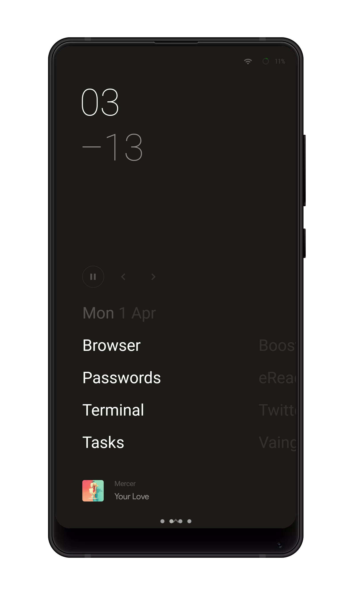
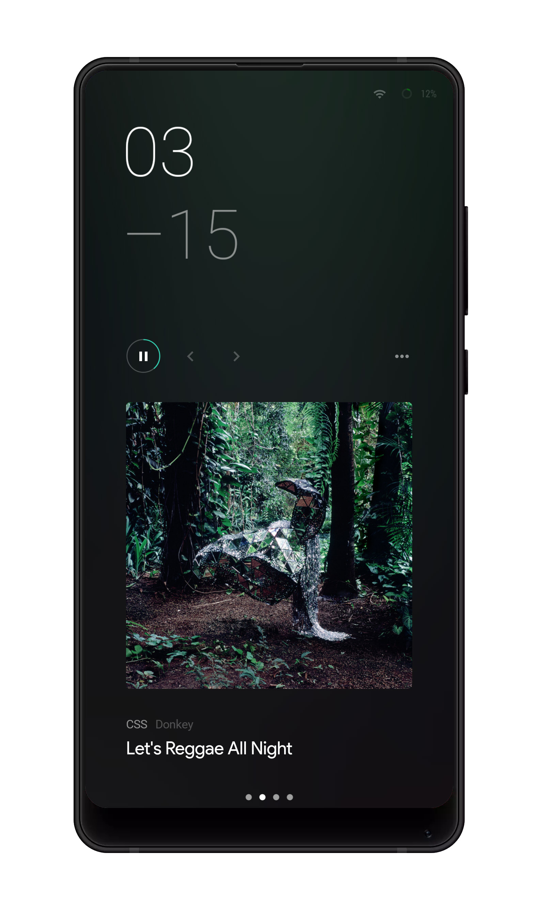
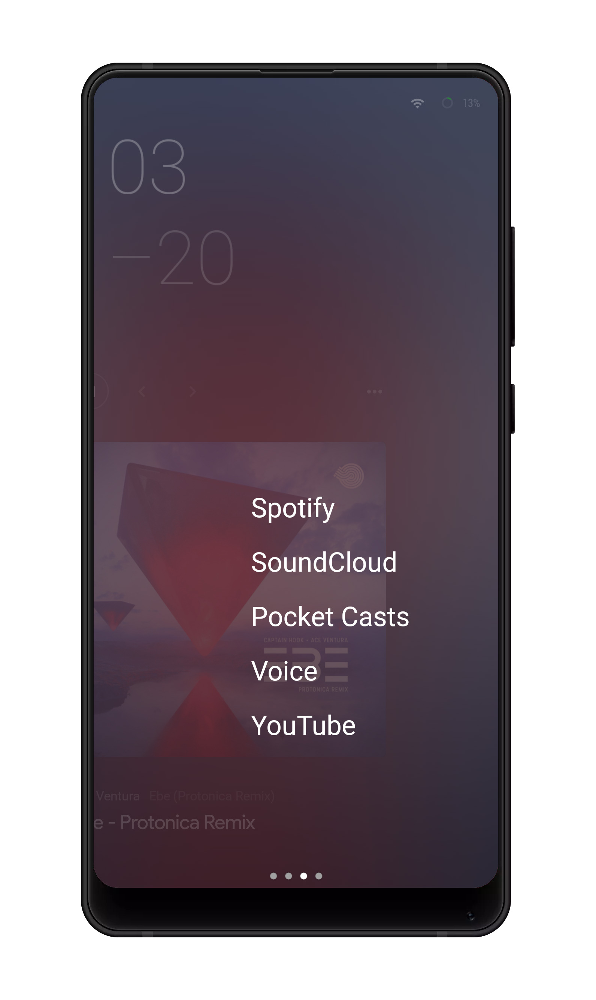
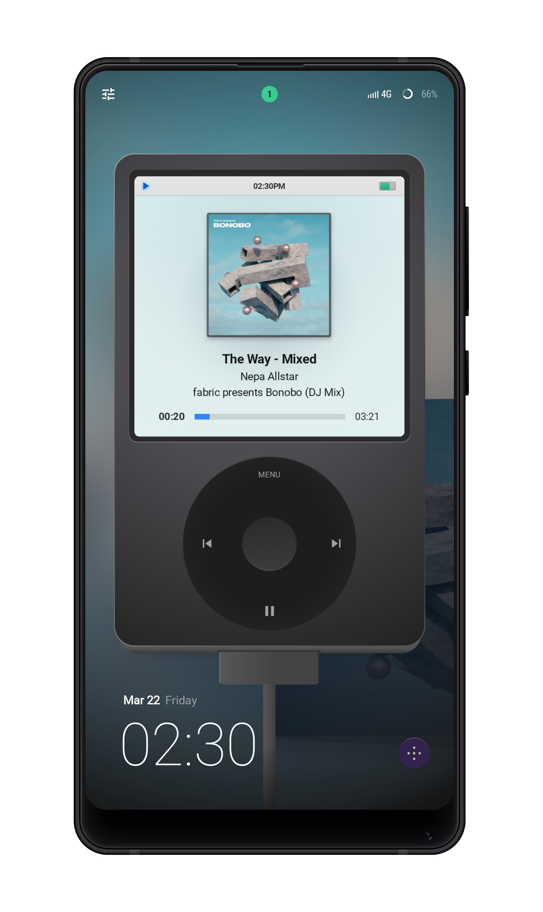
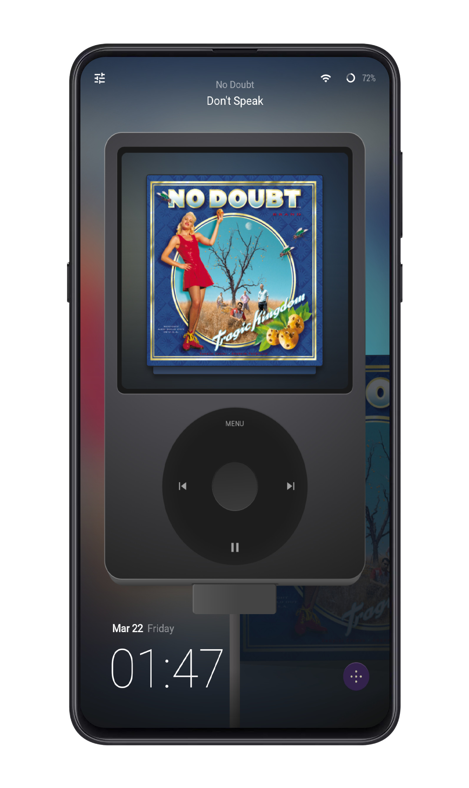
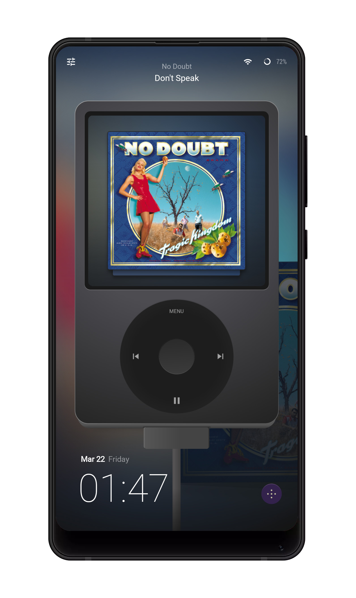
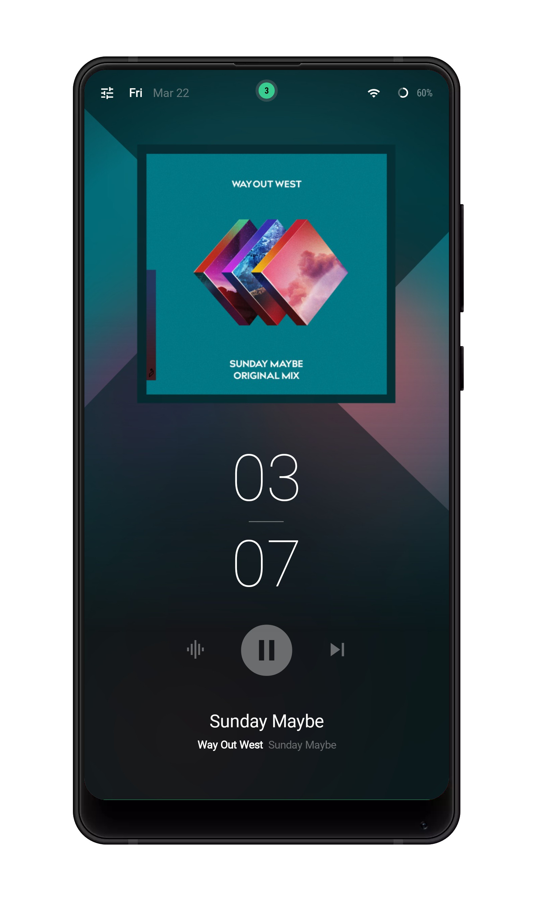
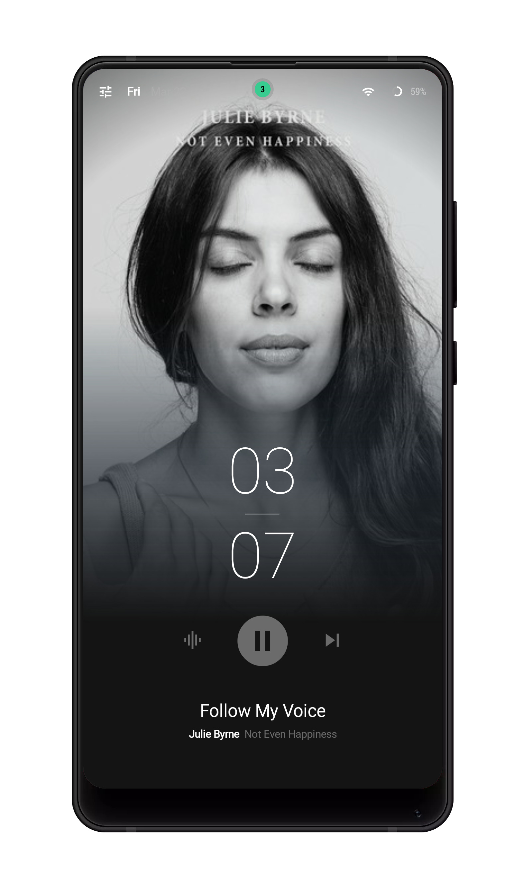
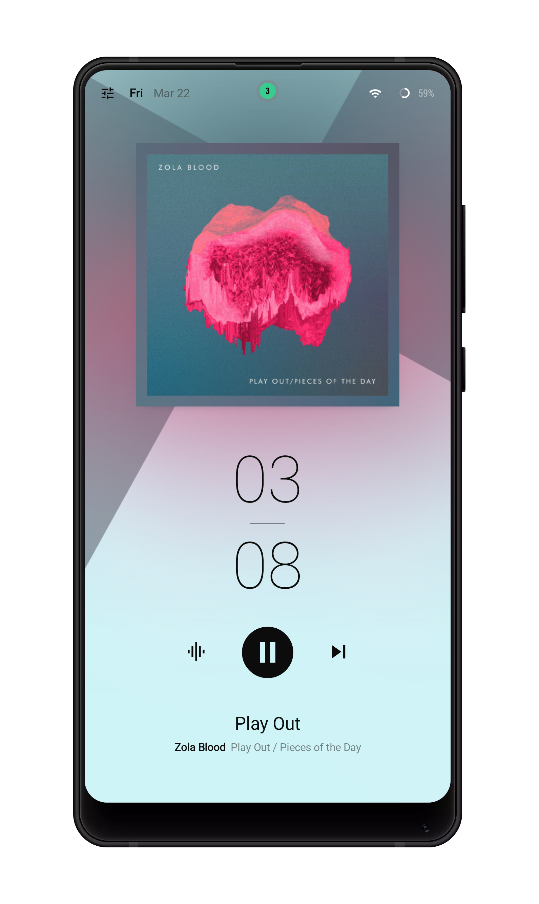

  

<h1 align='center'>
@rstacruz's klwp presets
</h1>

Pretty themes for KLWP

 

These themes require [KLWP][klwp] (Kustom Live Wallpaper) with a Pro key.

[klwp]: https://play.google.com/store/apps/details?id=org.kustom.wallpaper&hl=en

## [Hyphen](Hyphen/)

Distraction-free minimal UI inspired by Microsoft Zune and [LessPhone]. Four-page theme. [**Download**](https://github.com/rstacruz/klwp-presets/raw/master/Hyphen/Hyphen.klwp)

[LessPhone]: https://play.google.com/store/apps/details?id=me.aswinmohan.nophone&hl=en

|                           |                           |                           |
| ------------------------- | ------------------------- | ------------------------- |
|  |  |  |

## [iPod](iPod/)

Three-page theme optimized for 18:9 screens (with some support for 16:9). [**Download**](https://github.com/rstacruz/klwp-presets/raw/master/iPod/iPod.klwp)

|                         |                         |                         |
| ----------------------- | ----------------------- | ----------------------- |
|  |  |  |

## [Wallart](Wallart/)

Three-page theme optimized for 18:9 screens. [**Download**](https://github.com/rstacruz/klwp-presets/raw/master/Wallart/Wallart_1g.klwp)

|                            |                            |                            |
| -------------------------- | -------------------------- | -------------------------- |
|  |  |  |

## Thanks

[iPod icon](https://thenounproject.com/term/ipod/964148) designed by Made on the @NounProject
